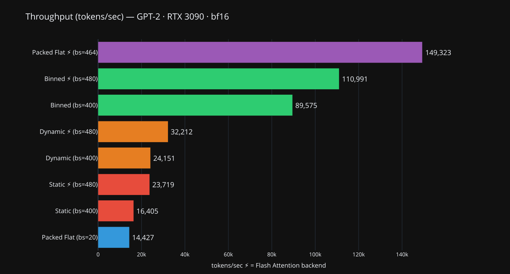

# Batching Strategies for Transformer Inference

Benchmarking different batching and padding strategies for GPT-2 inference on a single GPU. The goal is to measure throughput (tokens/sec) and understand the trade-offs between simplicity and efficiency.

## Strategies

**Static Padding** — every sequence padded to `max_length`. 

**Dynamic Padding** — sequences padded to the longest in the batch. 

**Binned Padding** — sequences grouped by similar length before batching, then dynamic-padded. Reduces padding further with almost no implementation cost. Controlled by `n_bins` parameter — more bins = tighter grouping = less padding = more throughput, but batches are no longer i.i.d. which may affect training dynamics.

**Packed Flattened** — multiple sequences packed into a single long 1D sequence using First Fit Decreasing bin packing. Requires either a materialized block-diagonal attention mask (expensive — `O(total²)` memory) or Flash Attention's `flash_attn_varlen_func` with `cu_seqlens` (no mask needed).

Since Packing requires Flash Attention varlen kernels for efficiency, I also applied the standard Flash Attention backend to all other strategies to ensure the comparison measures the impact of data layout, not just kernel optimizations.

| Strategy | What it is | Why it works | Why it matters |
| :--- | :--- | :--- | :--- |
| **Static** | Pads every batch to a fixed `max_length`. | No logic needed; uniform shapes for every step. | Provides a stable baseline but wastes the most VRAM/compute. |
| **Dynamic** | Pads only to the longest sequence in the current batch. | Reduces "empty" computation vs. the global maximum. | Simple way to increase throughput without changing data order. |
| **Binned** | Groups similar lengths before batching. | Minimizes padding tokens within each individual batch. | Massive speed boost (~3.4x) with minimal code changes. |
| **Packed** | Concatenates sequences into one continuous 1D array. | Zero padding. Every CUDA core does useful work on tokens. | The ultimate optimization for LLM training; saves maximum time and money. |

## Key findings

Packed Flat + Flash Attention is the clear winner at **~149k** tokens/sec. But the more surprising result is binned padding — a trivial change (group similar-length sequences) gets you to ~90-110k tokens/sec __without any custom attention kernels__.

The packed flattened strategy without Flash Attention (bs=20, ~14k tps) demonstrates exactly why `flash_attn_varlen_func` matters: materializing the full `(total × total)` attention mask limits batch size to **~20**, making packing __counterproductive__.

NB: Binned padding groups sequences by length, which breaks the i.i.d. assumption of SGD. Each batch sees sequences of similar length — short batches train on short texts, long batches on long texts. Whether this affects convergence is data-dependent and worth monitoring if used for training. Packing has a similar issue: sequences are packed by a bin-packing heuristic, not randomly.

## Flash Attention: two modes

Flash Attention v2 supports two calling conventions, and they're not interchangeable:

`flash_attn_func(q, k, v, causal=True)` — standard batched attention. Shape `(batch, seqlen, heads, dim)`. Applies causal mask internally, no padding awareness. Used here for static/dynamic/binned padding strategies.

`flash_attn_varlen_func(q, k, v, cu_seqlens_q, cu_seqlens_k, max_seqlen_q, max_seqlen_k)` — variable-length 1D attention. Shape `(total_tokens, heads, dim)`. `cu_seqlens` defines sequence boundaries; the kernel handles both causality and cross-sequence isolation. No mask materialized. Used here for packed flattened strategy.

Arbitrary attention masks are not supported by either — that's both the limitation and the reason for the speed.

## OOM detection

Finding the maximum batch size that fits in GPU memory is tricky because:

1. **OOM kills the process.** We run each test in a subprocess via `check_oom.py` and binary-search for the maximum batch size.

2. **Peak memory ≠ steady-state memory.** PyTorch creates temporary tensors during forward passes. To simulate worst-case peak usage, `check_oom.py` allocates doubled tensors (`dummy_` alongside `dummy`, `mask_` alongside `mask`) to approximate the overhead from intermediates.

3. **Packing makes it worse.** For packed sequences with materialized masks, the attention mask alone is `O(total ** 2)` — for bs=20 at seqlen=640, that's a `12800 x 12800` bool tensor (~156 MB). The OOM binary search naturally discovers this constraint.

4. **Worst-case mask size is an optimization problem.** The block-diagonal mask has total area `sum_i (len_i ** 2)`. For a fixed total length, this sum is maximized when all segments are equal. So `check_oom.py` uses equal-length segments of `max_length` — if it fits for this case, it fits for any real packing.

## Setup

- **Model:** GPT-2 (12 layers, 1024 hidden, 8 heads, ~125M params)
- **GPU:** RTX 3090 24GB
- **Precision:** bf16 via `torch.autocast`
- **Data:** WikiText-103, tokenized with `bert-base-uncased`, max 640 tokens per sample
- **Mode:** Inference only (`torch.no_grad`)
